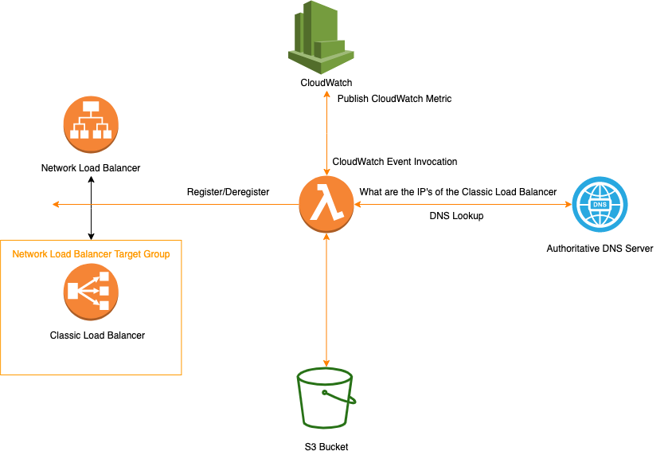

# AWSNLBtoCLB
Point NLB to CLB

This project is based on [this blog post](https://aws.amazon.com/blogs/networking-and-content-delivery/using-aws-lambda-to-enable-static-ip-addresses-for-application-load-balancers/) which implemented NLB->ALB previous to ALB's native integration with NLB. 

The same solution can be used for PRIVATE CLB's.
